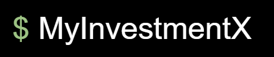
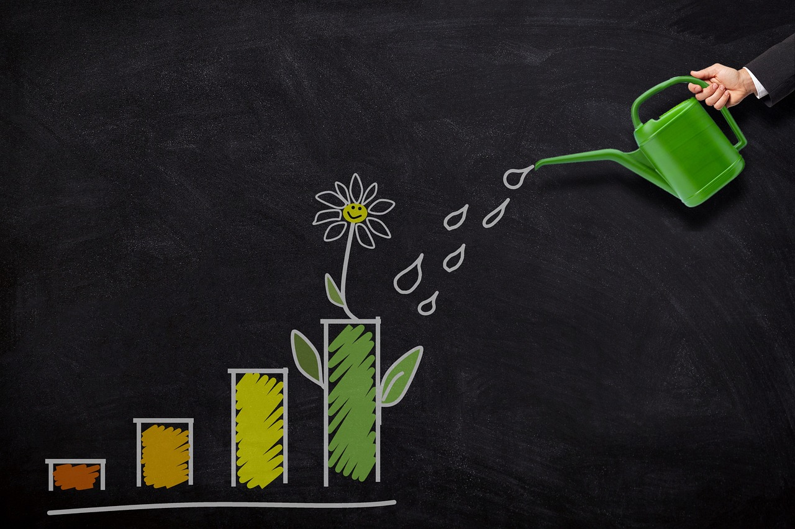

# My InvestmentX

Keep track your fund investments

**Index**
1. [Next Steps](#id1)
2. [Cloning](#id2)
3. [Environment variables](#id3)
4. [requirements](#id4)
5. [Get started](#id5)

## Next steps

4. Production + CI/CD + DB
5. MongoDB

6. APIs creation: Flask-RESTful
7. API securing
8. API errors
9. API documentation: flask-swagger-ui
10. Docker

11. Web in different languages
12. Background works
13. Remembering Password 
  

## Cloning

    git clone https://github.com/pjfernandecabo/myInvestmentX.git
    
> Later, I am going to tag the main parts and you could download them

    git checkout tags/<tag> -b <branch>

i.e.

    git checkout tags/APIS -b API

### Environment variables

#### Linux/Mac: 
> it is useful write them in .venv/bin/activate

    export FLASK_APP="entrypoint"

Next are convenient but I do not use yet

    export FLASK_ENV="development"
    export APP_SETTINGS_MODULE="config.local"

#### Windows

    set "FLASK_APP=entrypoint"
    set "FLASK_ENV=development"
    set "APP_SETTINGS_MODULE=config.local"
    
 

## Libraries - requirements

All the libraries you need are in 

    pip install -r requirements.txt

## Get started

    cd myFinanceX

    flask --app entrypoint run --debug --port 8008
or

    flask run --debug --port 8008